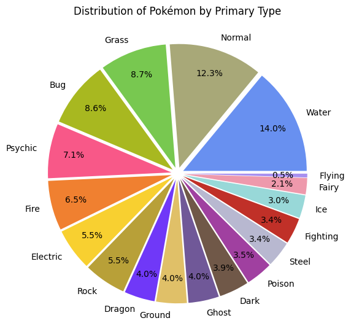
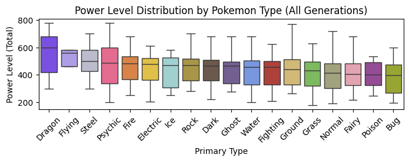
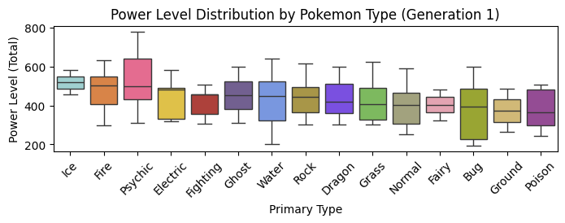
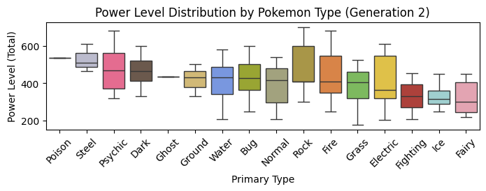
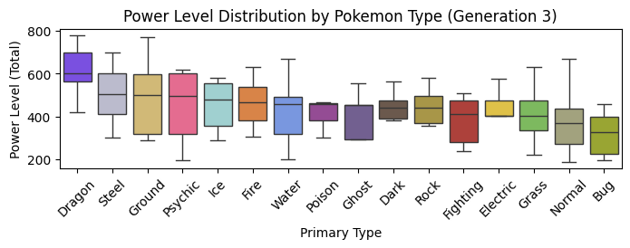
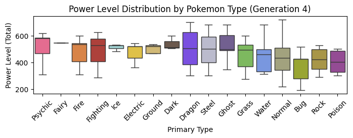
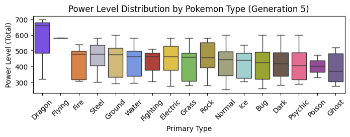
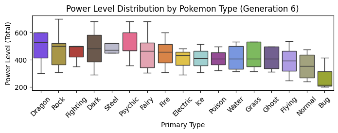
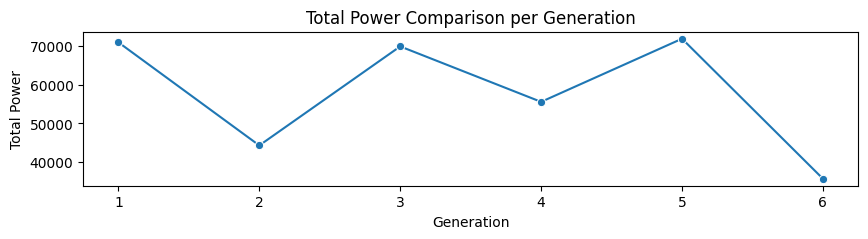
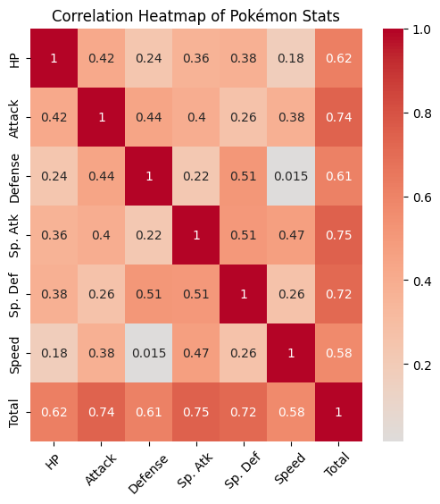

# Pokemon Study

- [Pokemon Study](#pokemon-study)
  - [Goals](#goals)
  - [Setting up the environment:](#setting-up-the-environment)
  - [Outputs](#outputs)
    - [Distribution per type](#distribution-per-type)
    - [Average power level](#average-power-level)
    - [Total power level](#total-power-level)
      - [Over generations](#over-generations)
    - [Stats](#stats)
      - [Correlations](#correlations)

* Based on dataset: https://www.kaggle.com/code/ash316/learn-pandas-with-pokemons/input

## Goals
1. Observe pokemon stats based on type and generation.
2. Define rules between types (i.e. fire types stronger against grass types) and try to find the strongest pokemons!
3. Catch 'em all.

## Setting up the environment:
1. Clone the repo, open terminal, `cd` to `pokemon-study` folder
2. Create a new virtual environment: `python -m venv venv`
3. Activate the virtual environment: `venv\Scripts\activate`
4. Install required libraries: `pip install pandas matplotlib seaborn`
5. (VSCode) `Ctrl + Shift + P` --> `Python: Select Interpreter`
6. `F5` and run `main.py`

## Outputs
### Distribution per type

  

### Average power level
Average power lever over primary types of pokemons vary over generations, with dragons leading and psychic pokemons occasionally trending.

  
  
  
  
  
  
  

An interesting fact is, the most populated types of Pokemon (namely Water, Normal, Grass and Bug types) tends to have lower power levels.

### Total power level
#### Over generations
There are no significant trends for power level over generations. However one can observe a zig-zag pattern, where a generation goes high in total power level and the next one going low. Then another high, then another low again.

Based on this analysis, a possible 7th generation of pokemons might be more likely to be more powerful than their previous generation (6th).

### Stats
#### Correlations
Some stats contribute more to total power level of a Pokemon than others. Here's a heatmap expressing these relationships:

There are some key takeaways from this analysis, such as:
* The **Total** power of a Pokemon is highly influenced by three stats: **Special Attack**, **Special Defense** and **Attack**.
* Interestingly, **Speed** has low correlation with **Defense**; meaning tougher Pokemons may be quick or slow, there are no relationships or dependencies.
  * Speed seems to have low correlation with any other stat as well, making it less of a factor for any further assumptions or calculations.
* **Attack** doesn't have a significant impact on **Special Attack** and vice-versa. Same is true for **Defense** and **Special Defense**. These pairs only seem to have somewhat medium-correlation.
* **HP** doesn't correlate to **Defense** at all, they seem to be independent.
* Overall, individual stats are independent from each other. 
  * However their weights on **Total** can be observed clearly with three stats (**Special Attack**, **Special Defense** and **Attack**) being more related compared to the rest.